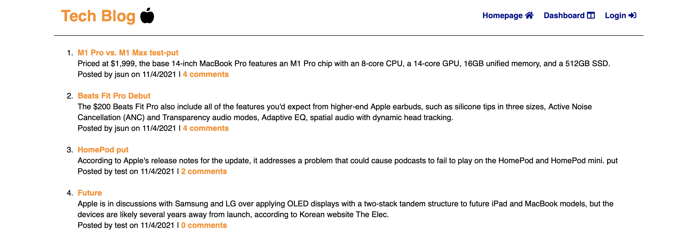
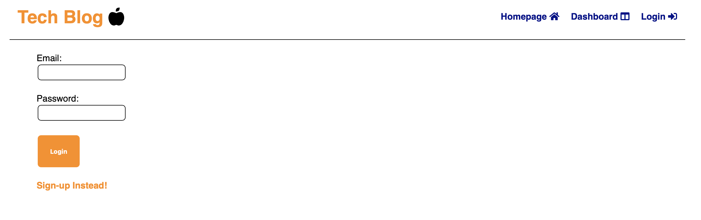
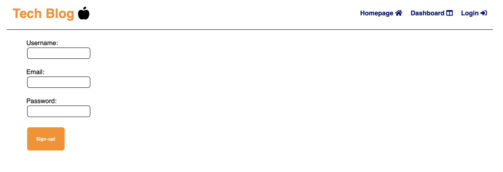
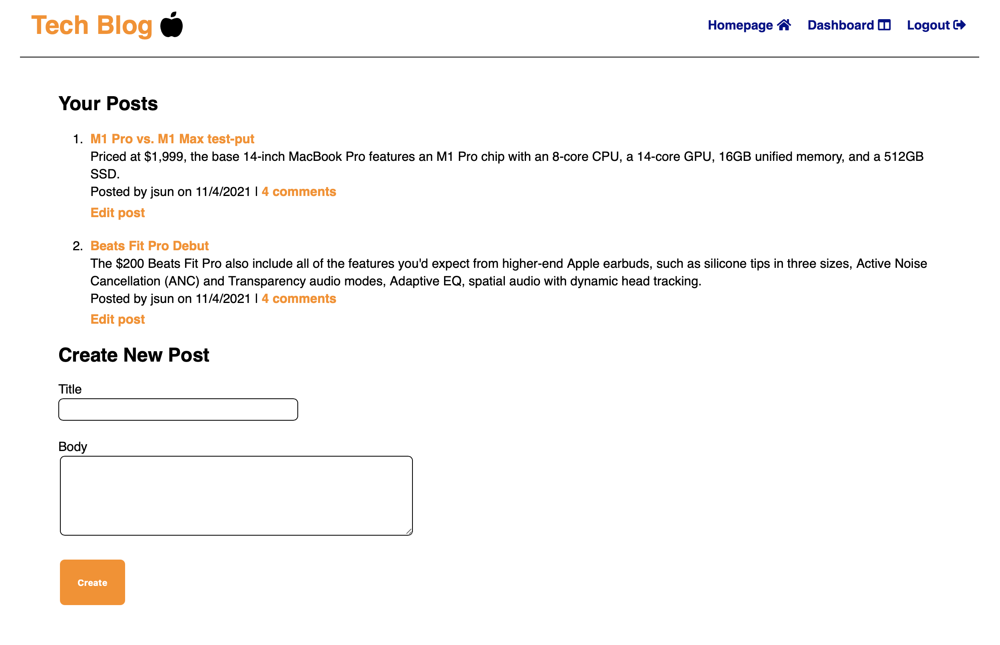
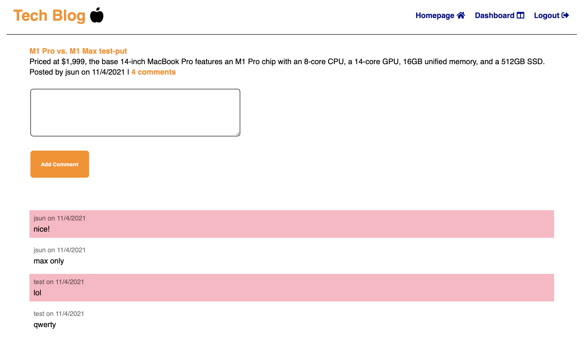
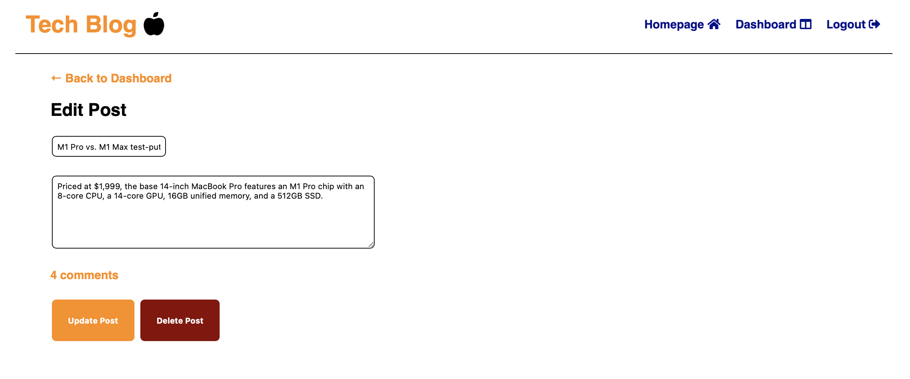

# Pro_Tech_Blog

[![Contributors][contributors-shield]][contributors-url]
[![Forks][forks-shield]][forks-url]
[![Stargazers][stars-shield]][stars-url]
[![Issues][issues-shield]][issues-url]
[![MIT License][license-shield]][license-url]

<!-- PROJECT LOGO -->
<br />
<p align="center">
  <a href="https://github.com/jsun994/pro-tech-blog">
    
  </a>

  <p align="center">
  A professional tech blog.
    <br />
    <a href="https://github.com/jsun994/pro-tech-blog"><strong>Explore the docs »</strong></a>
    <br />
    <br />
    <a href="https://pro-tech-blog.herokuapp.com/">View Demo</a>
    ·
    <a href="https://github.com/jsun994/pro-tech-blog/issues">Report Bug</a>
    ·
    <a href="https://github.com/jsun994/pro-tech-blog/issues">Request Feature</a>
  </p>
</p>

<!-- TABLE OF CONTENTS -->
<details open="open">
  <summary><h2 style="display: inline-block">Table of Contents</h2></summary>
  <ol>
    <li>
      <a href="#about-the-project">About The Project</a>
      <ul>
        <li><a href="#built-with">Built With</a></li>
      </ul>
    </li>
    <li>
      <a href="#getting-started">Getting Started</a>
      <ul>
        <li><a href="#prerequisites">Prerequisites</a></li>
        <li><a href="#installation">Installation</a></li>
      </ul>
    </li>
    <li><a href="#usage">Usage</a></li>
    <li><a href="#contributing">Contributing</a></li>
    <li><a href="#contact">Contact</a></li>
  </ol>
</details>

<!-- ABOUT THE PROJECT -->
## About The Project

    AS A developer who writes about tech
    I WANT a CMS-style blog site
    SO THAT I can publish articles, blog posts, and my thoughts and opinions


Demo - [Heroku](https://pro-tech-blog.herokuapp.com/)

### Built With

* dotenv
* mySQL2
* express.js
* sequelize
* bcrypt
* handlebars

<!-- GETTING STARTED -->
## Getting Started

To get a local copy up and running follow these simple steps.

### Prerequisites

This is an example of how to list things you need to use the software and how to install them.
* npm
  ```sh
  npm install npm@latest -g
  ```

### Installation

1. Clone the repo
   ```sh
   git clone git@github.com:jsun994/pro-tech-blog.git
   ```
2. Install NPM packages
   ```sh
   npm install
   ```

<!-- USAGE EXAMPLES -->
## Usage

    GIVEN a CMS-style blog site
    WHEN I visit the site for the first time
    THEN I am presented with the homepage, which includes existing blog posts if any have been posted; navigation links for the homepage and the dashboard; and the option to log in
    WHEN I click on the homepage option
    THEN I am taken to the homepage
    WHEN I click on any other links in the navigation
    THEN I am prompted to either sign up or sign in
    WHEN I choose to sign up
    THEN I am prompted to create a username and password
    WHEN I click on the sign-up button
    THEN my user credentials are saved and I am logged into the site
    WHEN I revisit the site at a later time and choose to sign in
    THEN I am prompted to enter my username and password
    WHEN I am signed in to the site
    THEN I see navigation links for the homepage, the dashboard, and the option to log out
    WHEN I click on the homepage option in the navigation
    THEN I am taken to the homepage and presented with existing blog posts that include the post title and the date created
    WHEN I click on an existing blog post
    THEN I am presented with the post title, contents, post creator’s username, and date created for that post and have the option to leave a comment
    WHEN I enter a comment and click on the submit button while signed in
    THEN the comment is saved and the post is updated to display the comment, the comment creator’s username, and the date created
    WHEN I click on the dashboard option in the navigation
    THEN I am taken to the dashboard and presented with any blog posts I have already created and the option to add a new blog post
    WHEN I click on the button to add a new blog post
    THEN I am prompted to enter both a title and contents for my blog post
    WHEN I click on the button to create a new blog post
    THEN the title and contents of my post are saved and I am taken back to an updated dashboard with my new blog post
    WHEN I click on one of my existing posts in the dashboard
    THEN I am able to delete or update my post and taken back to an updated dashboard
    WHEN I click on the logout option in the navigation
    THEN I am signed out of the site
    WHEN I am idle on the site for more than a set time
    THEN I am able to view comments but I am prompted to log in again before I can add, update, or delete comments







<!-- CONTRIBUTING -->
## Contributing

1. Fork the Project
2. Create your Feature Branch (`git checkout -b feature/AmazingFeature`)
3. Commit your Changes (`git commit -m 'Add some AmazingFeature'`)
4. Push to the Branch (`git push origin feature/AmazingFeature`)
5. Open a Pull Request

<!-- CONTACT -->
## Contact

Jay Sun - [email me](mailto:jaysun054@gmail.com)

[contributors-shield]: https://img.shields.io/github/contributors/jsun994/pro-tech-blog.svg?style=for-the-badge
[contributors-url]: https://github.com/jsun994/pro-tech-blog/graphs/contributors
[forks-shield]: https://img.shields.io/github/forks/jsun994/pro-tech-blog.svg?style=for-the-badge
[forks-url]: https://github.com/jsun994/pro-tech-blog/network/members
[stars-shield]: https://img.shields.io/github/stars/jsun994/pro-tech-blog.svg?style=for-the-badge
[stars-url]: https://github.com/jsun994/pro-tech-blog/stargazers
[issues-shield]: https://img.shields.io/github/issues/jsun994/pro-tech-blog.svg?style=for-the-badge
[issues-url]: https://github.com/jsun994/pro-tech-blog/issues
[license-shield]: https://img.shields.io/github/license/jsun994/pro-tech-blog.svg?style=for-the-badge
[license-url]: https://github.com/jsun994/pro-tech-blog/blob/master/LICENSE.txt